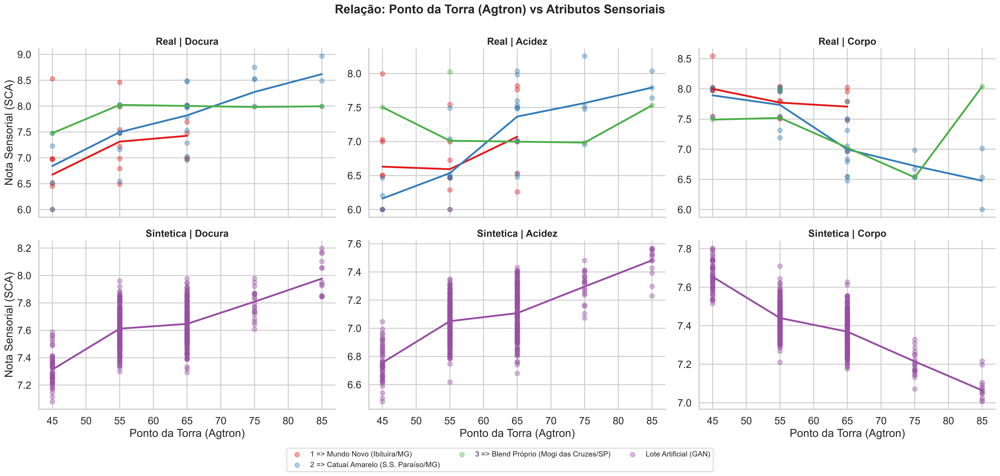
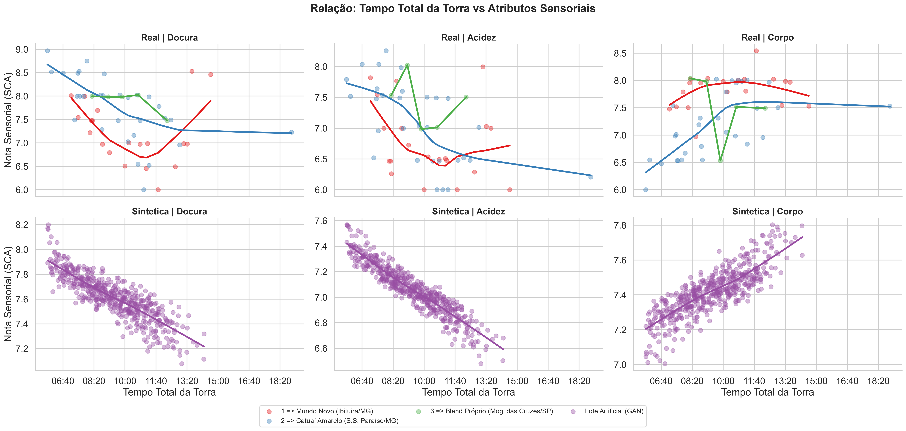
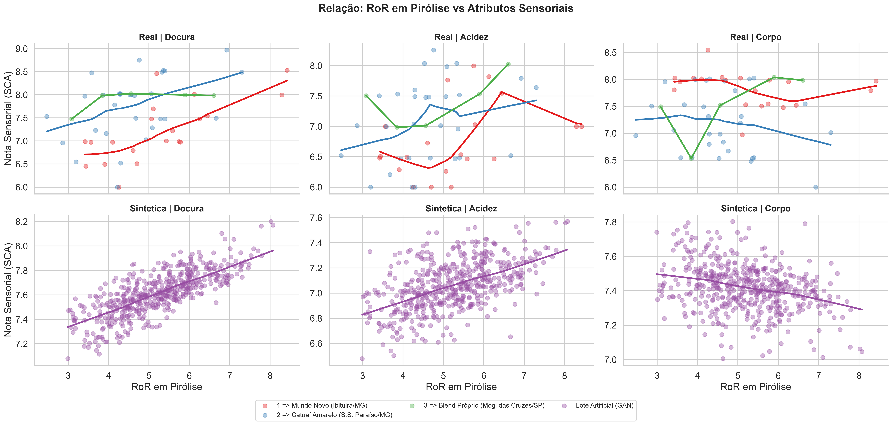

# Venezia

Sistema para monitoramento de torra de cafés especiais e posterior correlação com a avaliação sensorial (cupping) segundo o protocolo da SCA (Specialty Coffee Association).

> **Sobre este repositório.** Este é um repositório de apresentação, sem código-fonte.
> O código e os dados da pesquisa estão em repositório privado, com acesso mediante solicitação: mjcg12@yahoo.com.br

## Objetivo

Construir uma base de dados de torras reais e suas avaliações sensoriais, para investigar com aprendizado de máquina como as variáveis do processo de torra se relacionam com os atributos da bebida.

## Como funciona

1. O software monitora e registra as variáveis da torra em um torrador comercial, via Modbus/TCP.
2. Após a torra, a amostra é avaliada por cupping (protocolo SCA) e as notas são vinculadas à torra correspondente.
3. O algoritmo DBSCAN identifica agrupamentos por densidade entre as torras, tolerando ruídos dos sensores.
4. A análise de correlação (Pearson) relaciona as variáveis do processo aos atributos sensoriais, e os resultados são apresentados ao usuário.
5. O processo é contínuo: cada nova torra registrada atualiza os resultados pela reexecução das análises.

Como a obtenção de amostras reais é cara e limitada, o estudo também utilizou uma rede adversarial generativa (GAN) para ampliar de forma controlada o conjunto de dados, mantendo os dados sintéticos separados dos reais.

## Resultados principais

Através da análise paramétrica estratificada, observou-se que a linhagem genética e o *terroir* (representados por cada lote real) estabelecem *baselines* diferentes para a pontuação SCA, mas respondem a padrões termodinâmicos semelhantes durante a torra:
- **Influência do Lote:** Há uma clara segregação nas pontuações de Doçura, Acidez e Corpo dependendo do lote analisado (Mundo Novo, Catuaí Amarelo e Blend Próprio), com as curvas de tendência operando em patamares e variâncias distintos.
- **Comportamento Sensorial vs. Processo:** O tempo total e a taxa de ascensão (RoR) afetam diretamente a estrutura da bebida, demonstrando fortes tendências estatísticas (como o decaimento em certas notas em fases prolongadas).
- **Validação Sintética (GAN):** A eficácia do *Data Augmentation* foi medida objetivamente comparando as distribuições reais e sintéticas. O modelo adversário gerou amostras com um erro médio absoluto (MAE) quase nulo em relação ao *baseline* original, comprovando alta precisão na simulação do domínio real. As diferenças médias alcançadas foram: **Doçura (Δ = 0,04 pontos SCA)**, **Acidez (Δ = 0,06 pontos SCA)**, **Corpo (Δ = 0,03 pontos SCA)** e **Ponto de Torra (Δ = 0,62 graus Agtron)**. 
  > **Nota Metodológica:** Devido ao tamanho da amostragem física inicial (55 torras na fase original do estudo), margens de erro tão estreitas podem apontar para um possível *overfitting* (memorização da rede) durante o treinamento. Contudo, isso não invalida a metodologia arquitetada: o sistema é alimentado continuamente. Conforme a base empírica evolui e cresce com novos dados reais, a GAN é submetida a ciclos iterativos de retreinamento, o que assegurará expansão da generalização do modelo algorítmico em fases futuras.

A base contínua de dados que fundamenta esta análise conta hoje com cerca de 100 torras reais rigorosamente monitoradas e 500 torras sintéticas geradas para o estudo validatório inicial.

## Publicação

Esta pesquisa foi desenvolvida como Trabalho de Conclusão do MBA em Engenharia de Software da USP/Esalq (janeiro de 2026), com nota 10 em todas as etapas e indicação ao prêmio de melhor TCC. Seu resumo executivo foi publicado na Revista Estratégias e Soluções (Pecege):
https://revistaes.com.br/resumo-executivo/machine-learning-na-torra-e-analise-sensorial-de-cafes-especiais

## Análise de Dados e Correlações Sensoriais

Como parte dos resultados consolidados da pesquisa, realizou-se o cruzamento paramétrico entre as variáveis físicas da torra e as respectivas avaliações sensoriais (segundo protocolo SCA). As distribuições foram divididas entre as **amostras reais** (lotes distintos de café) e as **amostras sintéticas**, geradas artificialmente pela Rede Adversarial Generativa (GAN) em processo de *Data Augmentation*. 

Os painéis a seguir demonstram as dispersões e correlações (curvas de tendência suavizadas por regressão *LOWESS*) das notas de **Doçura, Acidez e Corpo** em função de três métricas termodinâmicas e temporais do processo de torrefação:

### 1. Ponto da Torra (Agtron) vs Atributos Sensoriais
Observa-se nas torras empíricas que perfis mais claros (maior grau Agtron) tendem a preservar ácidos orgânicos (acentuando a acidez), enquanto graus de torra mais escuros e avançados (menor grau Agtron) favorecem o desenvolvimento do corpo da bebida. O lote de torras sintéticas gerado pela GAN acompanhou com fidelidade essa inclinação, o que é corroborado estatisticamente pela continuidade das regressões locais e pela manutenção do suporte (*range*) da distribuição física subjacente.

### 2. Tempo Total da Torra vs Atributos Sensoriais
A duração macro do processo indica impacto na degradação prolongada de açúcares (diminuição relativa de doçura para tempos longos extremos) e na solidificação estrutural do grão (corpo). O modelo adversário demonstrou altíssima robustez ao captar exatamente os mesmos patamares de resposta sensorial encontrados na faixa de torra dos lotes originais.

### 3. Rate of Rise (RoR) em Pirólise vs Atributos Sensoriais
O RoR (*Rate of Rise* - °C/min) na fase de pirólise (ou Fase de Desenvolvimento, pós-primeiro crack) possui forte impacto nas reações aromáticas finais. Taxas mais contidas de transferência de calor nessa etapa auxiliam no controle das reações pirolíticas exotérmicas, modelando os atributos sensoriais da bebida resultante. Visualmente, a distribuição dos dados sintéticos replica com sucesso as aglomerações e tendências mapeadas pelas amostras físicas reais.

## Arquitetura

_(Diagramas UML - Visão macro do sistema)_

### Casos de Uso

### Diagrama de Classes (Visão Geral)

### Diagrama de Classes (Visão Lógica)

### Classes de Fronteira

### Classes Controladoras

### Classes de Entidades

### Diagrama de Implantação

## Capturas de Tela (Interface do Sistema)

Abaixo estão algumas imagens ilustrando as principais funcionalidades e interfaces do software desenvolvido.

### 1. Visualização de Torra

### 2. Análise e Agrupamento (DBSCAN)

### 3. Gráfico de Clusters (DBSCAN)

### 4. Configurações do Torrador

### 5. Treinamento da GAN (Rede Adversarial Generativa)

### 6. Cadastro de Lote de Café

### 7. Informações e Histórico da Torra

### 8. Avaliação Sensorial (Protocolo SCA)

### 9. Perfil Sensorial (Gráfico Radar)

## Tecnologias

C# (.NET 8), WPF, Modbus/TCP, DBSCAN, GAN

## Autor

Marco Aurélio Aloise Filho

## Licença

Copyright © 2026 Marco Aurélio Aloise Filho. Todos os direitos reservados.
